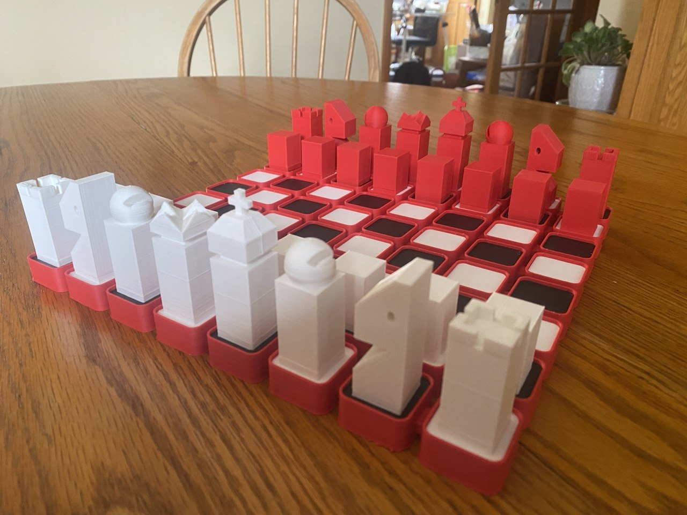
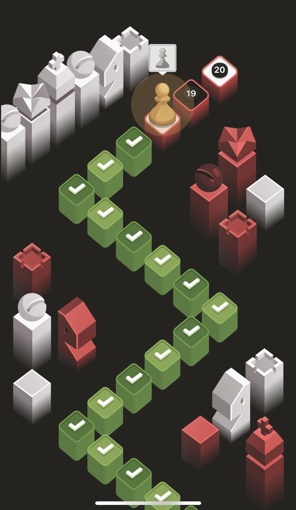
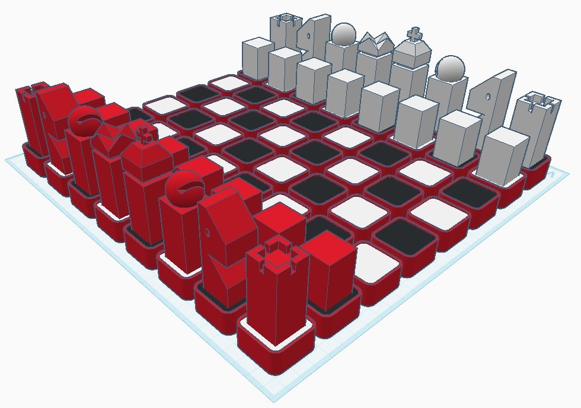
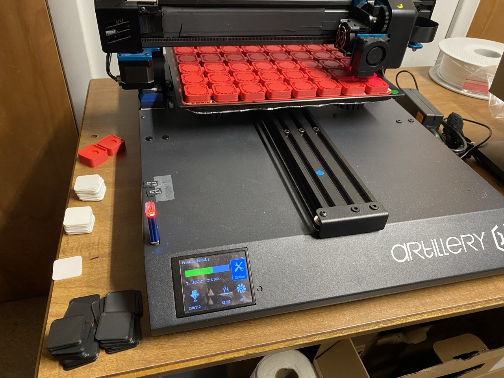
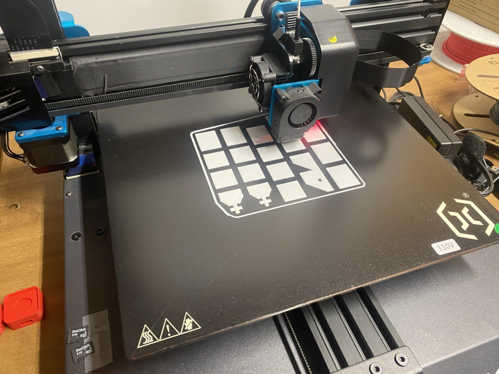
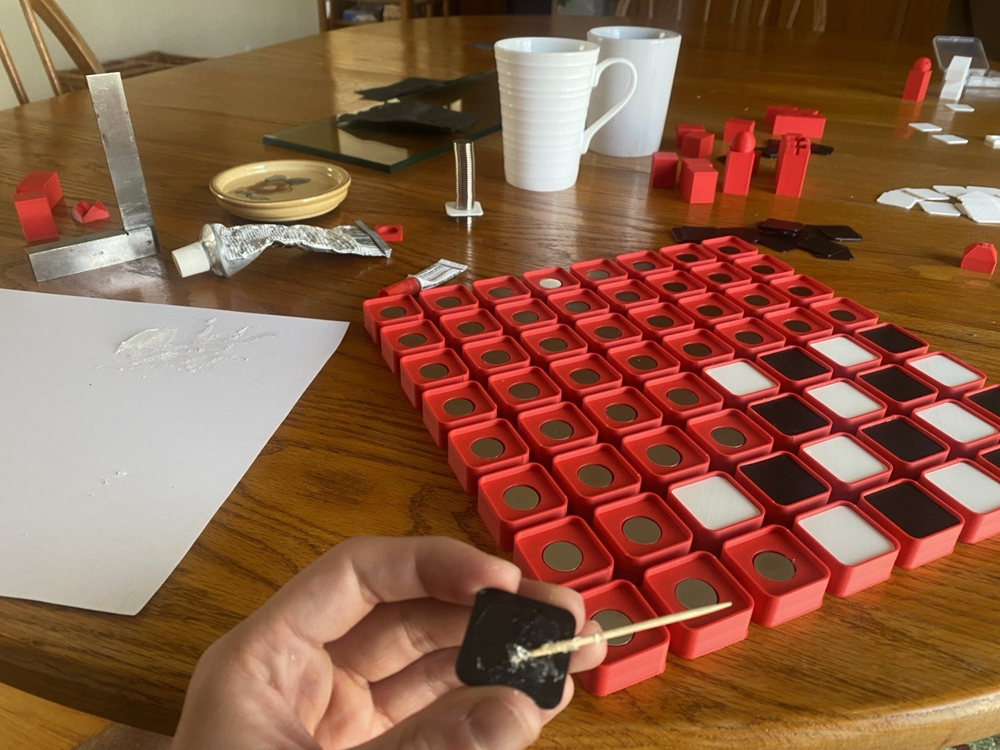
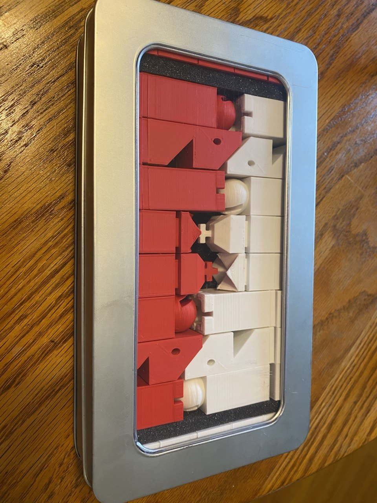

# Elite Chess Set

Here are the STLs up front: [Download (ZIP)](Elite%20Chess%20STLs.zip).

## A Chess Puzzle

I was _seriously_ into chess puzzles.  [I still am, but I was too.](https://en.wikiquote.org/wiki/Mitch_Hedberg)  Chess.com unleashes a sensory barrage on the chess puzzler in the name of gamification (of chess (a game)).  My favorite part of this barrage is the visual design of their puzzle tiers.

Chess.com puzzles operate on an XP→levels→tiers→prestiges→(maybe something else, I hope to never find out) system.  The tiers have names like "Wood", "Stone", "Bronze", "Silver", "Crystal", with consistent theming.  So you can probably guess that after Silver tier we have... "Elite" tier.

Forget the goofy name for a second, because the creation of Chess.com's Elite puzzle tier set off a causal chain resulting in Chess.com's graphic designers gifting the world this masterpiece:

I _love_ this design.  It's got a sharp but optimistic techno-utopic look.  The color scheme suits it so well.  It reminded me of a [space video game](https://en.wikipedia.org/wiki/MoonBase_Commander) from my youth.  A friend described it as "Windows 95 chess" and I'm a sucker for both rectilinearity and thoughtful low-poly.

## Another Dimension to the Puzzle

I wanted to know how the pieces looked in 3D; I wanted to play a physical game with them.

I did some digging for 3D-printable files online.  To my surprise, no one had any designs (free or otherwise) available.  I had to make my own design.

I've used [OpenSCAD](https://openscad.org/) to great success on complex jobs,  [Onshape](https://www.onshape.com/) to great success on intermediate jobs, [Tinkercad](https://www.tinkercad.com/) to great success on simple jobs, and [Blender](https://www.blender.org/) to precisely zero success on anything at all (skill issue).  This was an easy job; everything was rectilinear and made of simple geometric shapes, so I called upon Autodesk's perfect, powerful, pedagogical platform- Tinkercad.  Designing in Tinkercad is always a fun puzzle, but this was pretty straightforward.

The hardest thing to design was the board, which is not part of Chess.com's Elite tier background.  I'm quite happy with the design that models the red-outlined white/black squares from the level path.

I cut up some parts for cleaner printing and put pockets in the pieces and the squares for 15x2mm magnets.

The STLs are [here](Elite%20Chess%20STLs.zip), and the file naming convention describes the color/quantity of each piece.

## Additive Manufacturing

I got Bambu filament online because a friend recommended it.  It was expensive, but this chess set was the nicest print we've gotten from the Artillery Sidewinder.

I scaled all of models so that the board was nearly the size of the print bed.  The board printed nicely in one piece without warping.

## Adding Steps to the Manufacturing

There was no need to print in multiple filaments at once since most parts were one color.  But a chess set has a lot of pieces and a chess board has a lot of squares.  All said and done, I printed 103 parts.

I bought 100 15x2mm neodymium magnets, needing 96 of them for the 64 squares and 32 pieces.

I affixed the colored square tops to the large red board base with E6000 and joined the pieces together with Crazy Glue.  So far everything has held well!

## What the Manufacturing Added

I'm happy with how the set turned out and have been lucky enough to play many games on it, including an odds game I lost to my brother who started down a queen.

It's always a pleasure to see your ideas become real.  Projects aren't always as good in real life as they are in your head, but the snap of the magnets, the quality of the print, and the way the pieces coincidentally fit perfectly into a repurposed Pez-dispenser display box all make this chess set better than I could have ever hoped.

Special thanks to my dad for the use of his 3D printer and my mom for the Pez container!
