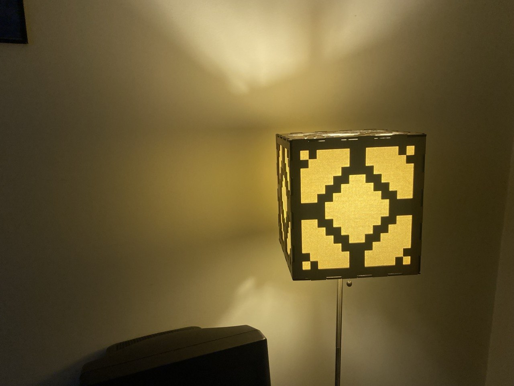

# Redstone Lamp

## The Lamp

In undergrad and grad school, students threw out perfectly good home furnishings when they moved.  This is how I became the proud owner of a warm color temperature lamp with a tasteful cubical fabric shade.

The cubical fabric shade was begging to become a [Minecraft redstone lamp](https://minecraft.wiki/w/Redstone_Lamp) and I was happy to oblige.

## Claude's Help

The most interesting part of the story is the design of the lasercutting files.  I had scheduled my trip to the lasercutter days in advance, but work kept me too busy to actually design the necessary SVG.

It felt like an action movie: 90 minutes on the clock, 2 SVG files to make, 1 metro to catch.

Why 2 files?  The lampshade is annoyingly not a cube; it is 10"x10"x11".  I needed one file for the top and bottom (cut twice) and one file for the sides (cut 4 times).

With limited time and my intermediate-at-best Inkscape acumen, I needed backup; I called in Claude Code.  I copied a JPG of the redstone lamp pixel art from the Minecraft game files, put it in a directory, described what I wanted in a markdown document, and told Claude to go.  After some serious fiddling and about 10 minutes, Claude had written a Python script which created an appropriately-scaled SVG of the top and sides (directly by string concatenation with no libraries; diabolical).

What came next was even more fiddling.  It took another hour to get _exactly_ what I wanted.

There were places where *I was unimpressed*.  I solved one dovetailing bug in the Python myself because Claude (Opus 4.7) was taking much too long for a 2-character fix.

There were also places where *I was impressed*.  Claude looked at the files and noticed that my description left small cubes open in all 8 corners because all of the dovetails went outward.  I don't know if this is a common mistake well-represented in the training data or if LLMs are useful generally for this kind of reasoning.  But I do know that if I had designed this solely myself, it would be missing the 8 corners and be slightly worse.

Claude and I finished exactly on time; [perhaps not coincidentally](https://en.wikipedia.org/wiki/Parkinson%27s_law).  It felt triumphant.

## Finishing

The shade cover was cut from Lowe's fictitious "Blondewood" and stained with upcycled mahogany stain from the MakerSpace.

The final assembly was an unanticipated challenge; I needed a way to keep the shade cover square while the glue was drying, while not putting wet glue on the lamp.  Painter's tape and patience were the ultimate solution.

I used Titebond III for all but the bottom seams and used Elmer's glue for the bottom seams.  This detail is uninteresting to everyone except me in the future trying to disassemble this lamp shade cover.
